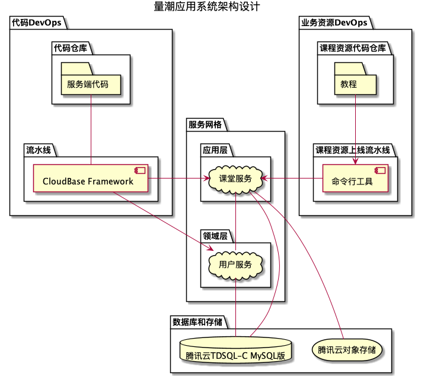

# 量潮应用系统（QtApps）

量潮应用系统（QuantTide Applications，简称QtApps），是量潮科技旗下软件应用体系的总称，目前主要由量潮课堂、量潮数据服务、量潮企业后台等三个APP及配套的公共服务和公共依赖组成。

## 系统架构

以服务网格为中心，连接数据库和存储、DevOps平台等。

服务网格内的应用以领域驱动设计（Domain-Driven Design, DDD）的思想分为两层：

- 应用层：包括2-3个面向用户的应用（一个或多个服务组成）、5-10个内部应用（通常一个服务），均需要相互通信。
- 领域层：取决于服务网格的支持，特别是数据平面对日志、监控、安全等功能的支持。理想情况是5个以内，无网格可能需要10个左右。

DevOps平台由两类构成：

- 工程代码：服务端、客户端等业务代码等。
- 业务资源：课程业务的教程资料（GitBook格式）等。

## 技术选型

采取**前后端分离**的模式，基于腾讯云云开发做**云原生**架构设计。

### 服务端选型

遵循云原生标准，包括容器化、无状态、不可变、基于API的协作等，具体为：

- 框架：Django和Django REST Framework
- 云服务：容器应用托管服务——云托管（微信云托管/腾讯云云开发云托管）

### 客户端选型

- 框架：Flutter全平台应用（Mobile/PC Web、Android、iOS、Windows、Mac）
- 云服务：腾讯云云开发的静态网站托管/腾讯云对象存储

### DevOps平台

以腾讯云的Coding为主。
