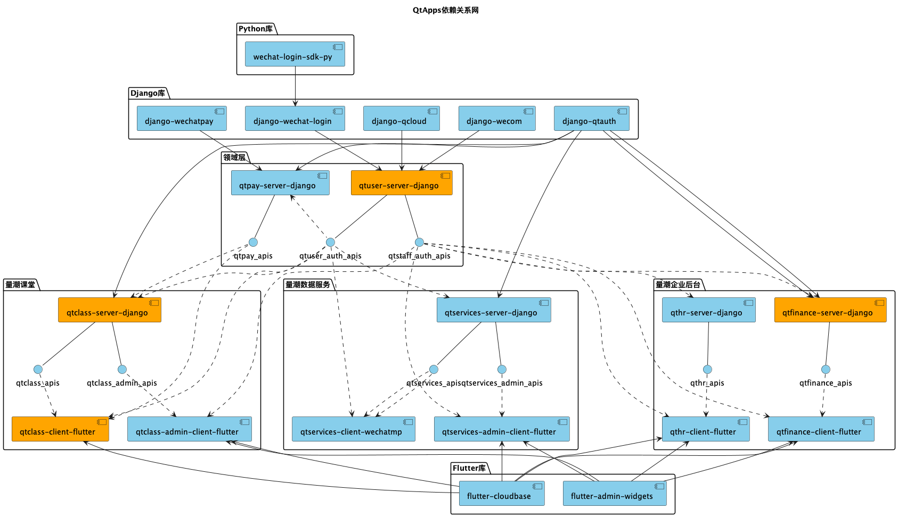
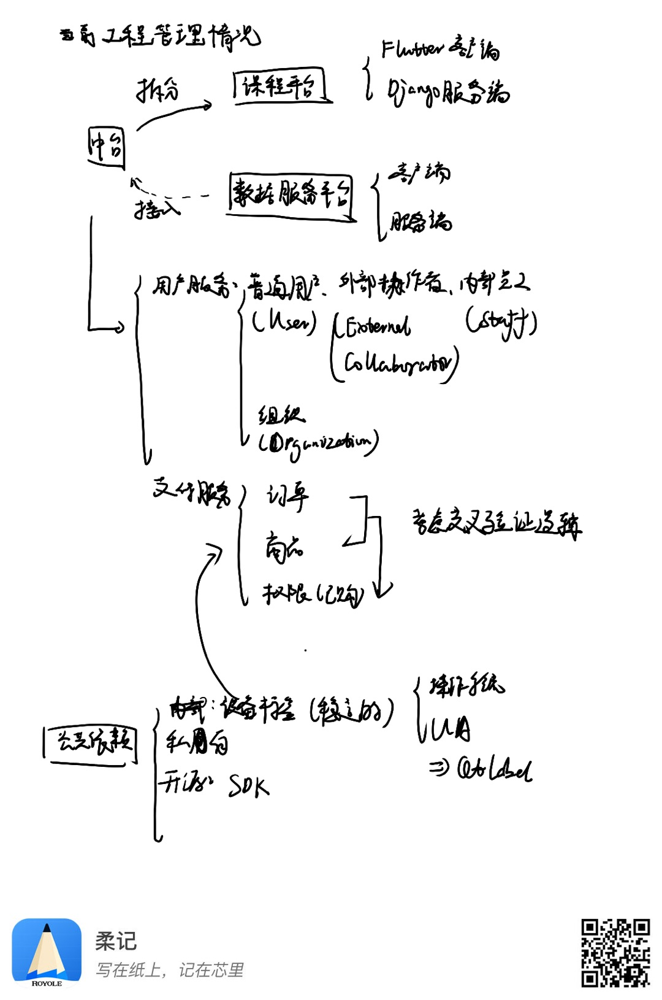

# 应用划分

## 应用分层

(2022-10-22更新：未完成。)

领域驱动设计下的分层：

- 用户界面层：各应用和子应用客户端，包括量潮课堂客户端等。
- 应用层：主要由量潮课堂、量潮数据服务、量潮云SaaS组成，包括量潮课堂服务端等。
- 领域层：主要由量潮云PaaS组成，包括量潮IdAM云、量潮支付云等。
- 基础设施层：主要由量潮开源所属内外部开源库组成，包括云SDK等。

## 依赖关系

(2022-10-22更新：未维护的旧稿。)

图例含义为：

- 文件夹为同一类代码仓库，以Coding项目为单位管理；
- 实线箭头为直接依赖，实线为关联关系（暴露API），虚线箭头为间接依赖（提供API）；
- 蓝色为未开发，橘色为开发中，黄色为已上线。

开发规范为：

- 语言和框架层面的公共依赖以发布版本的形式提供相对稳定版的依赖包给服务或应用使用；
- 服务端（服务）之间通过暴露API和调用API通信，客户端（应用）通过调用API通信。

## 从单体到微服务

(2022-10-22更新：旧稿。)

