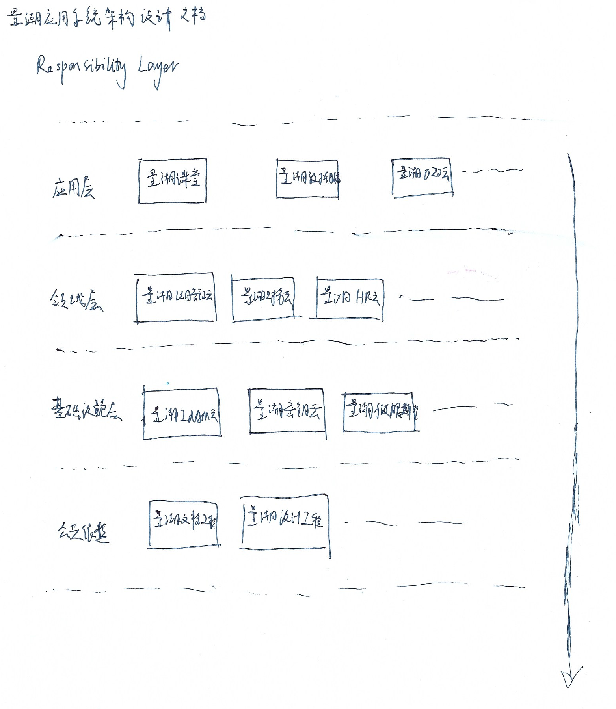

# 应用体系

## 应用分层

领域驱动设计定义的Responsibility Layer模式的大比例模型（参考《领域驱动设计》16.3节）如图所示。

分为如下五层：

- 用户界面层：各应用客户端，包括量潮课堂客户端等。
- 应用层：主要由量潮课堂、量潮数据服务、量潮云行业SaaS（i.e. 量潮O2O云）组成。
- 领域层：主要由量潮云通用SaaS（i.e. 量潮项目管理云）组成。
- 基础设施层：主要由量潮云PaaS（i.e. 量潮IdAM云）
- 公共依赖层：量潮开源所属内外部开源库（i.e. 云SDK、量潮设计工程、量潮文档工程）组成。

## 系统演化

随着系统越来越复杂，从单体到微服务的演化过程不断发生。

整个系统先是从单体变成微服务，如图所示。

同样的过程未来会在各个业务和应用中不断发生。
比如，量潮课堂业务演化成主站、管理后台、代码执行器三个业务，代码执行器未来会合并到量潮云IDE。
