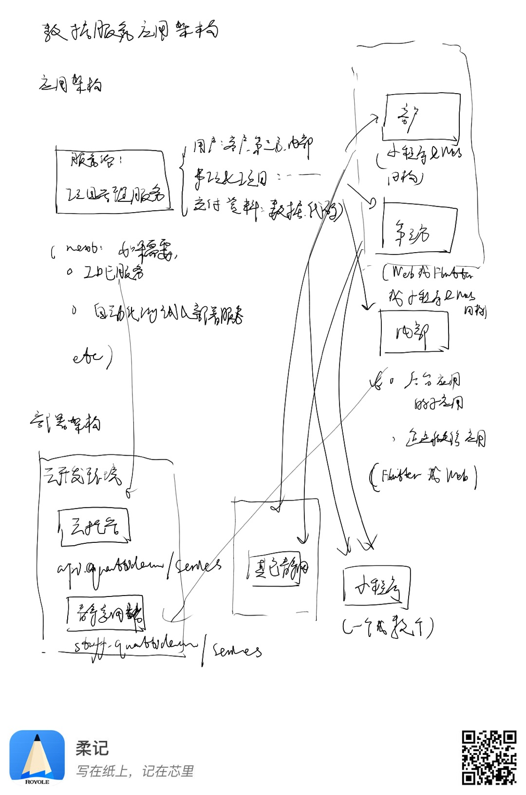

# 量潮数据服务

## 架构设计

### 应用架构

#### 服务端

主要为客户端提供统一的项目管理服务。

#### 客户端

分为：
- 用户：个人和/或团队
- 第三方：外包和助研
- 内部：作为子应用接入后台系统。

### 部署架构

主要使用云开发。
- 服务端部署在云托管上；
- 客户端部署在静态网站托管上。考虑到云开发暂不支持多个域名，可能考虑优先把后台应用部署在云开发的静网托管里。

### 技术选型

- 用户的客户端：小程序为主，电脑端为辅但必要。考虑使用小程序跨端架构（ie. Chameleon, Taro, Kbone等）。
- 第三方的客户端：可能Web电脑端为主、移动端（小程序、公众号网页、Web网页）为辅。考虑使用Web开发框架（React或者Vue）或者小程序跨端框架。
- 内部的客户端：和后台应用统一。主要支持企业微信应用（Web电脑、独立Web手机、企业微信内置Web手机），也可使用Flutter做跨平台应用。

## 架构演进

### Serverless化

使用云函数部署和工作流编排数据服务项目。主要是为了方便弹性扩容、异步处理，以及把函数作为拆分项目的单元方便项目管理和DevOps流程的构建。进一步地，为下一步进行领域驱动地积累做准备。

### 领域驱动

根据对大量订单的梳理总结积累一系列工具包，并且把写过的爬虫服务（i.e.通用存储服务、通用反爬服务、特定网站API等等）固定成稳定服务，通过工作流快速复用组装。

目前数据服务业务的效率远不足以支持一个成熟的创业公司，主要由于工程效率低下、交付质量无法保证，且复用积累困难。未来我们很有可能往新的方向进化，这里分析可能的演进方向以及对整个系统在架构层面和工程方面的影响。

### 低码化

如果可以不断把项目内的知识积累下，则有可能在工作流编排的帮助下实现更好的复用。为了提高整个流程的生产效率，我们可以尽可能把开发框架低码化，让内部成员、外包、甚至客户自己可以参与到开发中，并且开发成果可以迅速集成到系统里。我们可能需要：
- 在Coding基础上二次打包针对数据服务的具体场景定制的一站式开发平台，提供基本的云端IDE、调试和测试、提交代码等类似于云开发提供的功能即可，剩下的交给内部的业务负责人在Coding和腾讯云完成，或者在定制好的数据服务专用平台实现。大概的演进过程，可能是先在内部专门做一个，再逐步把权限开放给外包，最后开放给客户。
- 自动制定策略并采集数据和处理数据的SaaS服务，比较适合固定的场景，比如微博、知乎等大站，业务形态类似于神箭手。主要是把自动交付流程进一步扩展，用户制定策略以后，则复用现有的爬虫框架采集，然后复用自动交付流程给用户。

这里留下许多架构演进的问题，比如：
- 如何实现云端IDE？如何把云端IDE集成到某个业务系统里？（数据服务和课堂两个业务都需要用）
- 如何实现低码引擎？除了现有我们知道的以外，需不需要额外的特性，对于架构有没有不可预计的重大影响？
- 如何实现演进式地权限开放？
- 如何自动检测爬虫是否可用？
- 如何为客户和外包屏蔽云函数框架，而专注于实际函数实现？

### 从数据服务拓展到软件服务

数据服务流程相对固定且简单，而软件开发则往往比较复杂，用现有的方案做细粒度的管理难度很大，且数据服务项目的积累大多不可复用，需要重新积累。可能有的需求：
- 如何明确软件的需求？不再是通过明确数据结果和大体步骤即可确认，而是有可能需要PRD并且双方达成一致。可以预测，需要先在内部有一套自动化PRD和需求评审的方案，然后开放到数据服务平台上。
- 如何管理交付？达成一致很困难，自动化检测也很困难。可能意味着需要类似上面的方案，把内部用来验收App的机制开放出来。

