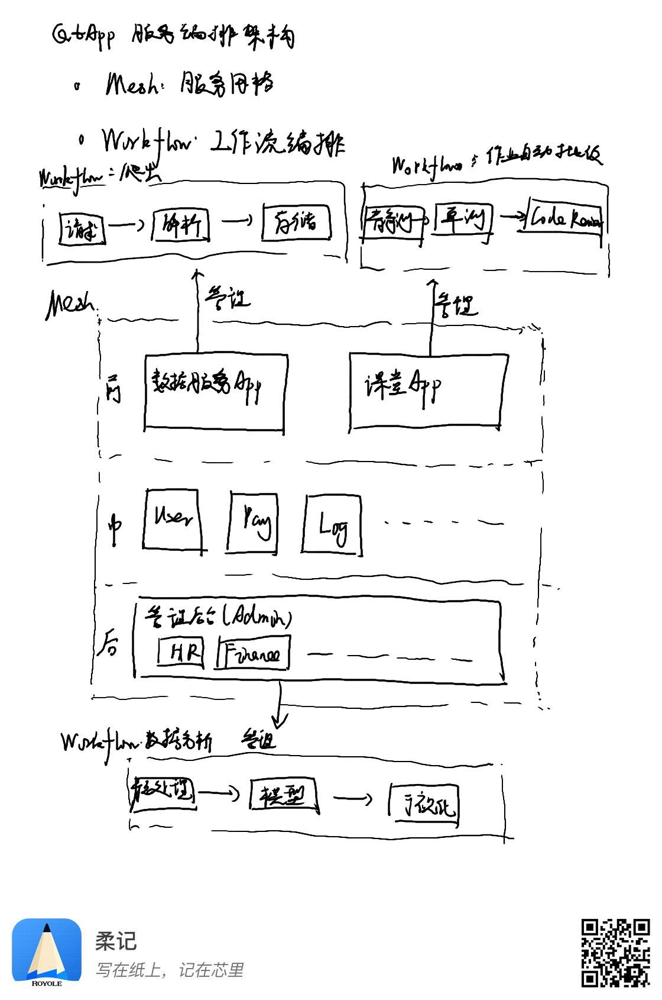

# 服务和应用编排

主要运用两种技术进行编排：
- 服务网格（Service Mesh）：初步计划使用腾讯云云开发（CloudBase）集成的微服务平台（TSF）功能，应用单元主要以云开发的云托管（CloudBase Run）为主，以云开发的云函数为辅。主要用以平台型服务和应用。用以做量潮应用系统的骨架，整个系统通过服务网格形成一个整体。
- 工作流（Workflow）：初步计划使用腾讯云应用与服务工作流（ASW），应用单元为云开发或Serverless的云函数。主要支持批量的流程化任务，主要是数据服务的爬虫（请求->解析->存储）、课堂的作业批改（静态检测->单元测试->人工审核）、后台应用的数据分析报表（预处理->建模->可视化）。

量潮应用系统的编排架构如下：

