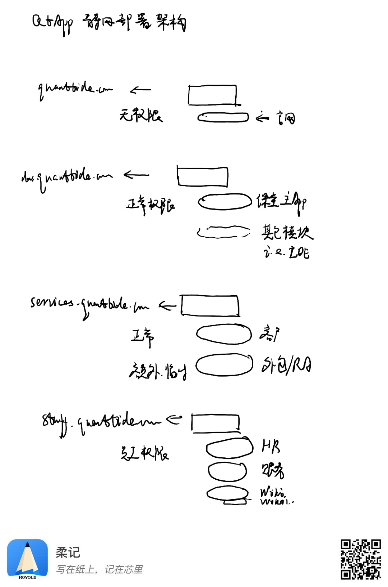

# 静态网站部署

## 部署架构

## 技术选型

目前有三个备选：
- COS静态网站托管：方便对每个存储桶级别做。
- 云开发静态网站托管：方便做DevOps流程、有技术支持、更熟悉云开发。
- Serverless静态网站托管：更方便做DevOps流程。

初步计划用云开发静态网站托管。由于不支持在一个环境内部署多个域名，考虑使用多个云开发环境管理不同应用的前端。其中：
- 主环境给服务端API和后台应用。
- 各个业务自己维护一个环境及应用。
- 公司官网另外找个方案，比如直接用COS。
