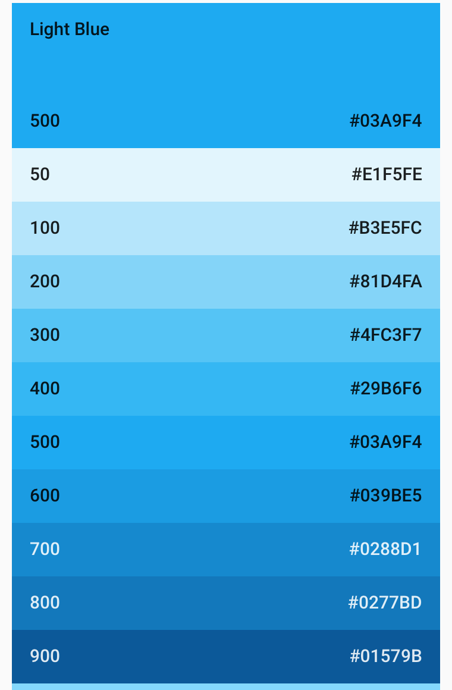

# 设计风格

## 目标

- 沉浸感。让用户感觉到美感和质感，激发热情和想象力，沉浸于需要长时间投入的活动中（i.e. 在量潮课堂APP中听课、做题等）。
- 用完即走。尽可能减少无关功能对用户的打扰，让用户达到目的以后就离开APP。专注于核心功能的设计以及功能之间的关联，形成一个整体；抛弃不相关的、打扰用户的冗余功能。

## 原则

主要原则：
- 简洁。符合我们对于产品风格最根本的预期，没有多余的元素、没有复杂的元素，一切以辅助用户提高对产品的直觉感知以方便使用为目的。
- 质感。Flutter和Material Design经常强调的风格（i.e. 玻璃态页面），有大量优秀的社区案例可以参考。和简洁不冲突，但有可能会因为增加复杂度，也有可能会因为不真实而降低用户的体验。
- 流畅。交互次数符合统计意义上的最优解，即大多数人的大多数行为可以路径最短到达。
- 自然、舒适。UX风格符合真实世界的行为、符合人的直觉。

次要原则：
- 真实感。对于量潮课堂APP，我们希望可以给用户带来最真实的课堂体验。现有的课堂APP显得比较枯燥，而过分强调质感的APP可能会失去真实感。可问题是，真实的课堂在手机端的表达应该是什么样的？Material Design强调大胆夸张的设计，追求让人眼前一亮的感觉，质感是符合这个原则的，所以我们可以看到大量这样的设计。真实感的目的是让用户更容易沉浸在课堂的氛围中，而质感也有可能带来另外一种沉浸感，比如唤醒用户的想象力、创造力，让用户处在一种积极的情绪中。我们的用户群体主要是年轻人，他们是一群有想象力、有热情、有创造力的人，必要的时候可以舍弃一些视觉上的真实感来换取对他们的吸引力。真实感的追求主要应当体现在模拟真实世界的UX行为，这也是和Material Design高度一致的。

## 预期效果

- 新用户：眼前一亮。简洁、质感，交互体验流畅舒适，感觉这是一个很不错的APP。
- 老用户：熟悉但依然有小细节可以发掘和探索。在更多细节隐藏更多设计，通过各种宣传渠道引导用户发掘。

希望可以听到的用户反馈：
- “虽然学编程很枯燥，但看到这么有设计感的APP就忍不住点开，然后就学下去了。”

## 方案

总体采用Material Design，方案设计对应Flutter提供的组件API。

### 主题（Theme）

#### 主题色

预期采用和Flutter默认颜色相近的颜色、和Logo相近的颜色。“量潮”的名字中的“潮”以及诞生地厦大都和海相关，考虑选择合适的海蓝色。

选择一个合适的颜色（明确编号）固定下来作为量潮的主题色，并且跟着调Logo的颜色。

（2021.02.23更新）初步确定的方案：
- 主题色：light blue，饱和度600，深色800，浅色400；
- 辅助色：暂不使用。

关于颜色的工程规范，详见：https://www.mdui.org/design/style/color.html

### 背景

初步计划使用**玻璃态页面**。

据说是2021年新的流行。好处是：
- 视觉效果好：不反光、不伤眼。用户需要长时间使用看视频做题，不伤眼对于用户来说十分重要。

问题是，是否适合我们的需求？是否会被我们的用户喜爱？
- 张果的父亲，50岁，教师，喜欢此UI效果，提出不反光的优点。 

参考资料：
- Flutter包：
  - https://pub.dev/packages/glassmorphism
- Flutter案例：
  - https://www.bilibili.com/video/BV1Qr4y1T7pc
  - https://www.bilibili.com/video/BV1Li4y1c7Rc

### 启动页/闪屏页

详见：https://flutter.cn/docs/development/ui/advanced/splash-screen

### 滑动效果（Sliver）

使用Flutter提供的Sliver，主要用于APP首页和汇总信息页面（i.e. 课程主页），详见：https://flutter.cn/docs/development/ui/advanced/slivers。

### 无障碍

#### 语音控制

方便在没有眼睛或者没有手的情况下使用。

系统语音助手已经比较发达，比如Siri、小爱同学等。目前的主要问题是，APP接入语音助手做的工作不够，导致APP的交互不够智能、语音助手的功能也比较鸡肋。
- iOS的Siri：可以通过在APP内置快捷指令帮助用户导入语音控制操作。
- 小米的小爱同学：设置捷径。
- 华为的小艺：“设置 > 智慧助手 > 智慧语音 > 我的技能”。

在制作语音控制操作指南的过程中，可能会发现有交互设计不方便语音控制的地方，交互设计需要跟着做适应和调整。

整理语音控制操作指南，放在APP的帮助中心和公众号自定义目录里，让有需要的用户跟着学习即可。

直觉感觉需要搜索功能，语音搜索翻译文字再搜索。需要在APP内解决“关键词->点击行为”这个交互命令的转化。初级的方法是一个一个场景设置，高级的方法是内置一个AI。

### 护眼

- 考虑加一个连续使用计时，连续使用一个小时提示。

----

## Problems

- 背景色是否采用玻璃态页面？
- 自己和团队不熟悉语音控制。

