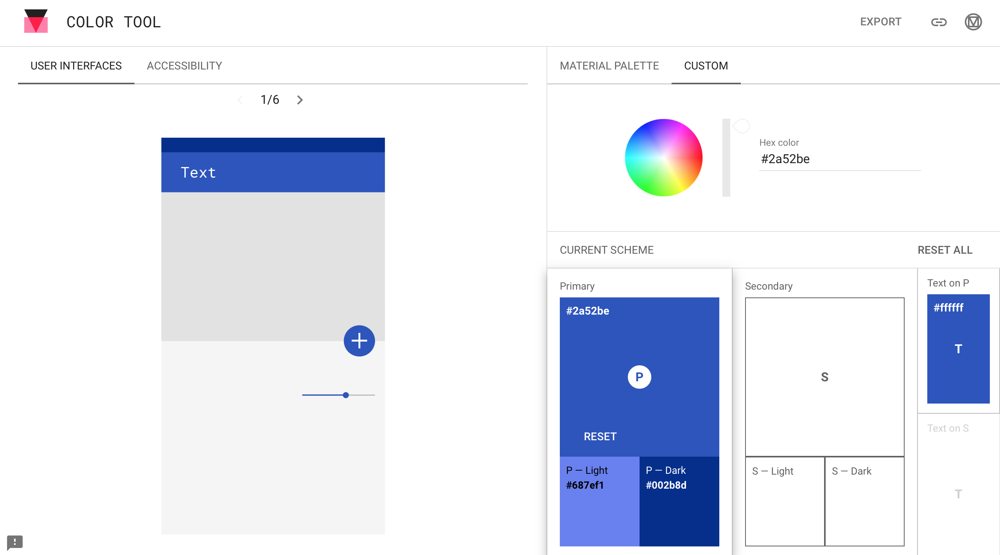

# 颜色

## 主色

### 色系

选择[**蓝色系**](https://www.eggradients.com/shades-of-blue-color)作为主题色。[蓝色的寓意](https://www.supercolor.com/blog/the-meaning-of-the-color-blue/)为：

> The color blue represents both the sky and the sea and is associated with open spaces, freedom, intuition, imagination, inspiration, and sensitivity. Blue also represents meanings of depth, trust, loyalty, sincerity, wisdom, confidence, stability, faith, and intelligence. 

### 主色

从以上色谱中，初步考虑使用[**天青蓝/钴天蓝（Cerulean Blue）**](https://www.eggradients.com/color/cerulean-blue-color)，颜色效果为：

寓意为：

> This is a very special and vivid color. It is a synthetic dye that has historically been very expensive and difficult to purify. You can use this color for your nails or heels, or even as eyeshadow. This fashionable color will make you more attractive and youthful!

在产品设计中的效果为：

> Product Design is far more than creating an aesthetically pleasing object. It’s about presenting an idea, a solution, or a new paradigm to people in the most effective and meaningful way possible. Your design must persuade them to buy your solution and influence their opinion about it. Products exist to solve problems.

### 调色板

参数：
- hex: `#2a52be`
- RGB: `rgb(42,82,190)`

使用[Material官方调色板](https://material.io/resources/color/#!/?primary.color=2a52be&view.left=0&view.right=0)的效果如图：

可用性问题主要在黑色字体的显示：

## 字体颜色

根据以上可用性结果，Primary和P-Dark使用White Text，P-Light使用While Text。

考虑到Material Design对于字体不透明度的要求，此结果可能表达有一定问题，需要再进一步针对三种颜色调整字体颜色。

