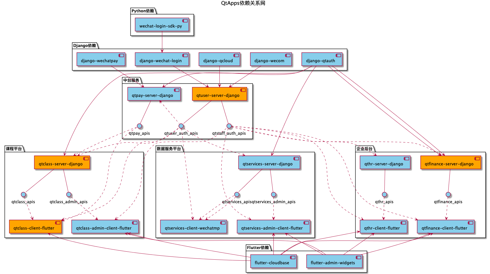

# 公共依赖

## QtApps依赖关系

代码仓库层面的依赖关系如图：

图例含义为：
- 文件夹为同一类代码仓库，以Coding项目为单位管理；
- 实线箭头为直接依赖，实线为关联关系（暴露API），虚线箭头为间接依赖（提供API）；
- 蓝色为未开发，橘色为开发中，黄色为已上线。

开发规范为：
- 语言和框架层面的公共依赖以发布版本的形式提供相对稳定版的依赖包给服务或应用使用；
- 服务端（服务）之间通过暴露API和调用API通信，客户端（应用）通过调用API通信。
